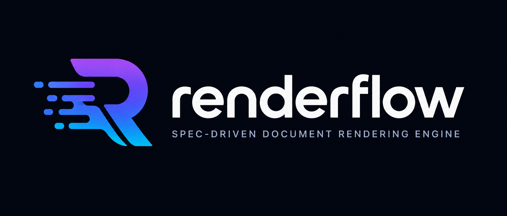

<div align="center">

<div align="center">
  <a href="https://github.com/egohygiene/renderflow">
    
  </a>
</div>

*Spec-driven document rendering engine — transform Markdown into publication-ready PDF, HTML, DOCX, and more.*

[](https://github.com/egohygiene/renderflow/actions/workflows/ci.yml)
[](https://github.com/egohygiene/renderflow/actions/workflows/release.yml)
[](LICENSE)
[](https://www.rust-lang.org/)
[](https://www.rust-lang.org/)

</div>

---

## What is Renderflow?

Renderflow is a config-driven rendering engine that transforms documents into polished output — no complex shell scripts, no Pandoc flags to memorize.

Define your output spec in YAML. Point it at your source. Run one command.

At its core, Renderflow models every transformation as a **directed acyclic graph (DAG)**. The graph engine finds the optimal path between your source format and each target, shares intermediate steps across outputs, and executes independent conversions in parallel using Rayon.

---

## Features

- 📄 **Multi-format output** — Render to PDF, HTML, DOCX, and more from a single config file
- 🗂️ **YAML-driven spec** — Declarative, repeatable, version-controllable builds
- 🔀 **Graph engine** — DAG-based transform planner with parallel execution and shared intermediate steps
- 🎯 **Optimization modes** — Choose Speed, Quality, Balanced, or Pareto-optimal path selection
- 🔄 **Transform pipeline** — Pluggable in-memory content transforms (built-in and custom)
- 🤖 **AI transforms** — Ollama and OpenAI-compatible LLM integration with local caching
- 🖼️ **Image conversion** — FFmpeg-backed format conversion across 80+ image formats (JPEG, PNG, WebP, AVIF, HEIC, EXR, and more)
- 🎵 **Audio conversion** — FFmpeg-backed format conversion across 40+ audio formats (WAV, FLAC, MP3, AAC, Opus, and more)
- 🧩 **Custom templates** — Per-output Jinja2-compatible templates via [Tera](https://keats.github.io/tera/)
- 🔌 **Plugin system** — Register external transform executors at runtime without modifying core
- 🖼️ **Asset management** — Automatically resolves and validates image paths
- 🔍 **Dry-run mode** — Preview what will be built without writing any files
- 👁️ **Watch mode** — Automatically rebuild on file changes with configurable debounce
- ⚡ **Incremental builds** — Content-hash-based caching skips unchanged outputs
- 🦀 **Built with Rust** — Fast, safe, and reliable

---

## Quick Start

**1. Create your Markdown document (`input.md`):**

```markdown
# My Document


Welcome to my publication.
```

**2. Create a config file (`renderflow.yaml`):**

```yaml
input: "input.md"
output_dir: "dist"
outputs:
  - type: pdf
  - type: html
```

**3. Render:**

```bash
renderflow build
```

Output files appear in `dist/`:

```
dist/
├── input.pdf
└── input.html
```

---

## Installation

### Via Homebrew (macOS and Linux)

```bash
brew trust egohygiene/renderflow
brew tap egohygiene/renderflow https://github.com/egohygiene/renderflow
brew install renderflow
```

> **Note:** The `brew trust` step is required before tapping because this is a third-party tap. Without it, Homebrew will refuse to load the formula with an "untrusted tap" error.

Pandoc is installed automatically as a dependency.

### Via Scoop (Windows)

```powershell
scoop bucket add egohygiene https://github.com/egohygiene/renderflow
scoop install renderflow
```

### Via Chocolatey (Windows)

```powershell
choco install renderflow
```

### Via Snap (Linux)

```bash
snap install renderflow --classic
```

### Portable install script (macOS/Linux)

```bash
curl -fsSL https://raw.githubusercontent.com/egohygiene/renderflow/main/scripts/install.sh | sh
```

You can pin a release version with `RENDERFLOW_VERSION` and override install location with `RENDERFLOW_INSTALL_DIR`.

### Via AUR (Arch Linux)

Stable release:

```bash
yay -S renderflow
```

Latest git build:

```bash
yay -S renderflow-git
```

### Via Debian / Ubuntu (.deb)

Download the `.deb` for your architecture from the [Releases page](https://github.com/egohygiene/renderflow/releases/latest) and install:

```bash
sudo dpkg -i renderflow_*.deb
```

### Via RHEL / Fedora / openSUSE (.rpm)

Download the `.rpm` for your architecture from the [Releases page](https://github.com/egohygiene/renderflow/releases/latest) and install:

```bash
sudo rpm -i renderflow-*.rpm
```

### Download pre-built binary (all platforms)

Pre-built binaries are available for Linux (x86_64, aarch64, ARMv7, i686), macOS (Intel, Apple Silicon), and Windows (x86_64) on the [Releases page](https://github.com/egohygiene/renderflow/releases/latest).

| Platform | Binary |
|---|---|
| Linux x86_64 (musl) | `renderflow-x86_64-unknown-linux-musl` |
| Linux x86_64 (glibc) | `renderflow-x86_64-unknown-linux-gnu` |
| Linux aarch64 (musl) | `renderflow-aarch64-unknown-linux-musl` |
| Linux aarch64 (glibc) | `renderflow-aarch64-unknown-linux-gnu` |
| Linux ARMv7 | `renderflow-armv7-unknown-linux-musleabihf` |
| Linux i686 | `renderflow-i686-unknown-linux-musl` |
| macOS Intel | `renderflow-x86_64-apple-darwin` |
| macOS Apple Silicon | `renderflow-aarch64-apple-darwin` |
| Windows x86_64 | `renderflow-x86_64-pc-windows-msvc.exe` |

### Build from source

Requires [Rust](https://rustup.rs) and [Pandoc](https://pandoc.org/installing.html).

```bash
cargo install --path .
```

### Verify installation

```bash
renderflow --version
renderflow version
renderflow env
renderflow doctor
```

---

## Usage

```bash
# Render using the default renderflow.yaml config
renderflow build

# Render using a custom config file
renderflow build --config my-project.yaml

# Shorthand: pass the config file directly
renderflow my-project.yaml

# Preview what would be built, without writing any files
renderflow build --dry-run

# Enable verbose or debug logging
renderflow build --verbose
renderflow build --debug
```

> **Note:** The argument to `renderflow` is always a YAML config file. The Markdown source is specified inside the config via the `input` key (e.g. `input: "input.md"`).

### Multi-output example

Produce PDF, HTML, and DOCX from one config:

```yaml
input: "report.md"
output_dir: "dist"
outputs:
  - type: pdf
  - type: html
    template: "default"
  - type: docx
```

### Variables example

Inject dynamic values that are replaced at build time:

```yaml
input: "report.md"
output_dir: "dist"
variables:
  title: "Q4 Report"
  author: "Jane Smith"
outputs:
  - type: html
```

`report.md`:

```markdown
# {{title}}

*Written by {{author}}*
```

### Template example

Point an output at a custom Tera template stored in `templates/`:

```yaml
input: "report.md"
output_dir: "dist"
outputs:
  - type: html
    template: "newsletter"
```

Renderflow will render using `templates/newsletter.html` (Jinja2-compatible [Tera](https://keats.github.io/tera/) syntax).

### Input format override example

By default, Renderflow infers the input format from the file extension. Use `input_format` to override this explicitly — useful when the file extension doesn't match the content, or when working with formats such as RST, HTML, or EPUB:

```yaml
input: "document.rst"
input_format: rst       # explicitly tell Pandoc to read this as reStructuredText
output_dir: "dist"
outputs:
  - type: html
  - type: pdf
```

See [Supported Input Formats](#supported-input-formats) for the full list of accepted values.

---

## Watch Mode

Watch mode monitors your source files and automatically rebuilds whenever a change is detected.

```bash
# Watch using the default renderflow.yaml config
renderflow watch

# Watch using a custom config file
renderflow watch --config my-project.yaml

# Override the debounce delay (default: 500 ms)
renderflow watch --config my-project.yaml --debounce 300
```

**How it works:**

1. An initial build runs immediately when watch mode starts.
2. Renderflow watches the config file, the input document, and the `templates/` directory for changes.
3. After a file change is detected, Renderflow waits for the debounce delay (default: 500 ms) before triggering a rebuild — so rapid successive saves don't cause redundant builds.
4. Build errors are logged but do not stop the watcher; the next save will trigger another attempt.

**File watching scope:**

| Watched path       | Mode        | Notes |
|--------------------|-------------|-------|
| Config file        | Non-recursive | e.g. `renderflow.yaml` |
| Input document     | Non-recursive | Path from the `input` key |
| `templates/` dir   | Recursive   | Watched when the directory exists |

Press **Ctrl+C** to stop watch mode.

---

## Configuration

Renderflow is entirely driven by a YAML spec file (default: `renderflow.yaml`):

```yaml
input: "input.md"         # Path to your source document
input_format: markdown    # Optional: override auto-detected format
output_dir: "dist"        # Output directory (default: dist)
variables:                # Optional: key/value pairs for substitution
  title: "My Document"
  author: "Jane Smith"
outputs:
  - type: pdf             # Render to PDF (requires Pandoc + Tectonic)
  - type: html            # Render to HTML
    template: "default"   # Optional: use a custom Tera template
  - type: docx            # Render to Word document
```

### Configuration Reference

| Key            | Required | Default      | Description |
|----------------|----------|--------------|-------------|
| `input`        | ✅ Yes   | —            | Path to the source document (Markdown, HTML, RST, etc.) |
| `input_format` | ❌ No    | auto-detect  | Override the input format; auto-detected from file extension when omitted |
| `output_dir`   | ❌ No    | `dist`       | Directory where output files are written |
| `outputs`      | ✅ Yes   | —            | List of one or more output targets (must contain at least one entry) |
| `outputs[].type` | ✅ Yes | —           | Output format: `html`, `pdf`, `docx`, or any supported audio/image format |
| `outputs[].template` | ❌ No | —        | Name of a Tera template in the `templates/` directory to use for this output |
| `variables`    | ❌ No    | `{}`         | Map of string key/value pairs injected into the document via `{{key}}` placeholders |

### Supported Input Formats

The `input_format` key (or the file extension of `input`) controls how Pandoc reads the source document.

| Value      | File Extensions   | Notes |
|------------|-------------------|-------|
| `markdown` | `.md`, `.markdown`| Default when extension is unknown |
| `html`     | `.html`, `.htm`   | |
| `rst`      | `.rst`            | reStructuredText |
| `docx`     | `.docx`           | |
| `epub`     | `.epub`           | |
| `latex`    | `.tex`            | |

When `input_format` is omitted, Renderflow auto-detects the format from the file extension and falls back to `markdown` when the extension is unrecognised.

### Supported Output Types

**Document formats:**

| Type   | Description                   | Requirements      |
|--------|-------------------------------|-------------------|
| `html` | Renders to HTML               | Pandoc            |
| `pdf`  | Renders to PDF via LaTeX      | Pandoc + Tectonic |
| `docx` | Renders to Word document      | Pandoc            |

Not every input → output combination is supported. For example, `epub` and `latex` inputs cannot currently be converted to `docx`. Renderflow reports a clear error when an unsupported combination is specified.

**Image formats** (via FFmpeg):

Common formats: `jpeg`, `png`, `webp`, `avif`, `gif`, `bmp`, `tiff`

Professional/HDR: `exr`, `hdr`, `dpx`, `cin`

**Audio formats** (via FFmpeg):

Lossless: `wav`, `flac`, `aiff`, `alac`

Lossy: `mp3`, `aac`, `ogg`, `opus`, `wma`

Multichannel: `ac3`, `dts`, `truehd`

### Templates

Templates live in a `templates/` directory and use [Tera](https://keats.github.io/tera/) syntax (Jinja2-compatible). Specify a template per output with the `template` key. A `default` HTML template is included out of the box.

### Variables

Define a `variables` map in your config to inject dynamic values into your document:

```yaml
variables:
  title: "Q4 Report"
  author: "Jane Smith"
  version: "1.0"
```

Reference them in your Markdown using `{{key}}` syntax:

```markdown
# {{title}}

*Written by {{author}}*

Version: {{version}}
```

Placeholders for undefined keys are left unchanged, and a warning is emitted so you can spot typos.

---

## Transforms

Before any output is written, Renderflow applies a series of in-memory text transforms to the source document. Transforms run in order after the file is read and before Pandoc processes it.

### EmojiTransform

Replaces emoji characters with the literal text `[emoji]`.

**Why:** PDF and some LaTeX backends cannot render Unicode emoji directly. This transform ensures the pipeline doesn't crash on emoji-heavy content.

**Format-aware behaviour:** When rendering to HTML, emoji are preserved unchanged because browsers render them natively. For PDF and DOCX outputs, emoji are always replaced with `[emoji]`.

**Example:**

| Input                  | PDF / DOCX output             | HTML output            |
|------------------------|-------------------------------|------------------------|
| `Hello 😀 World`       | `Hello [emoji] World`         | `Hello 😀 World`       |
| `🎉 Party time! 🎉`   | `[emoji] Party time! [emoji]` | `🎉 Party time! 🎉`   |

**Limitation:** The replacement is a plain-text placeholder. Full SVG/image-based emoji embedding is planned for a future release.

### VariableSubstitutionTransform

Replaces `{{key}}` placeholders in the source document with values defined in the `variables` map of your config.

**When it runs:** Before Pandoc, so substituted values are part of the rendered content.

**Behaviour:**

- Keys are matched exactly (whitespace around the key name is trimmed, so `{{ title }}` and `{{title}}` are equivalent).
- If a placeholder references a key that is not in `variables`, the placeholder is left unchanged and a warning is emitted.
- Unclosed placeholders (e.g. `{{unclosed`) are also left unchanged.
- **Code block protection:** Placeholders inside fenced code blocks (` ``` ... ``` `) and inline code spans (`` `...` ``) are **not** substituted, so example code in your document is never corrupted.

### SyntaxHighlightTransform

Normalises the language tags on fenced code blocks (` ``` `) to lowercase with surrounding whitespace stripped.

**When it runs:** Before Pandoc, ensuring consistent language identifiers are passed to the syntax highlighting engine.

**Example:**

| Input fence       | Normalised fence    |
|-------------------|---------------------|
| ` ```Rust `       | ` ```rust `         |
| ` ```  Python  `  | ` ```python `       |
| ` ```JavaScript ` | ` ```javascript `   |

### AI Transform (`AiTransform`)

Applies an LLM prompt to document content before rendering.

**Backends:**

| Backend   | Endpoint                           | Notes |
|-----------|------------------------------------|-------|
| `ollama`  | `http://localhost:11434` (default) | Local model via Ollama |
| `openai`  | OpenAI-compatible API              | Prefer `api_key_env`; `api_key` remains supported for compatibility |

**Caching:** Responses are cached locally using a SHA-256 hash of the prompt + input content. Unchanged content is never re-sent to the model.

**Secure API keys:** Prefer `api_key_env` so secrets stay out of YAML:

```yaml
transforms:
  - name: ai-transform
    ai: openai
    model: gpt-4o-mini
    api_key_env: OPENAI_API_KEY
    from: markdown
    to: html
    cost: 1.0
    quality: 0.9
```

### CommandTransform

Pipes document content through an external command.

**Pipe-based** (stdin → stdout):
```yaml
transforms:
  - name: my-filter
    command: pandoc-filter
    args: []
```

**File-based** (uses `{input}` / `{output}` placeholders):
```yaml
transforms:
  - name: my-filter
    command: my-tool
    args: ["--in", "{input}", "--out", "{output}"]
```

### Plugin System

Register custom transform executors at runtime without modifying the core engine. Implement the `PluginExecutor` trait in your own crate and register it with the `PluginRegistry`:

```rust
use renderflow::transforms::plugin::PluginExecutor;

struct ReversePlugin;

impl PluginExecutor for ReversePlugin {
    fn name(&self) -> &str { "reverse" }
    fn execute(&self, input: String) -> anyhow::Result<String> {
        Ok(input.chars().rev().collect())
    }
}
```

> **See it in action:** The [`examples/transforms/`](examples/transforms/) directory contains a complete working example that exercises all three built-in transforms.

---

## Transform Failure Modes

Renderflow provides two transform failure modes that control what happens when a transform encounters an error during document processing.

### FailFast (default)

The pipeline aborts immediately on the first transform error and surfaces the error to the caller. This is the default when running `renderflow build`.

```yaml
# renderflow.yaml — default behaviour: a failed transform stops the build
outputs:
  - type: html
```

**When to use:** In CI pipelines and production builds where a broken transform should be a hard failure.

### ContinueOnError

The failing transform is skipped, an error is logged, and the pipeline continues with the unmodified input passed to the next transform.

Renderflow uses `ContinueOnError` automatically in watch mode (`renderflow watch`) so that a single transform failure does not halt the watcher — the next file-save will trigger another attempt.

```yaml
# renderflow.yaml — watch mode implicitly uses ContinueOnError
outputs:
  - type: html
```

**When to use:** Watch mode and resilient rebuild pipelines where best-effort output is preferable to a complete failure.

### Optional transforms

AI transforms and command transforms are always **optional** in the sense that they only run when explicitly configured. If the external backend (Ollama, OpenAI, external tool) is unavailable the transform fails, and the active failure mode determines whether the build aborts or continues.

```yaml
# Omitting the ai/command key means the transform is simply not registered
outputs:
  - type: html
# No transforms key → no AI or command transforms are applied
```

### AI transform failure behaviour

When an AI transform (`AiTransform`) fails — for example, because the Ollama server is not running or the API key is invalid — the error is propagated according to the active failure mode:

- **FailFast** (default): build aborts with a clear error message identifying the failing transform.
- **ContinueOnError** (watch mode): the AI transform is skipped, the original document content passes through unchanged, and the build continues.

Cached responses are reused across builds: if the same prompt + content hash was seen in a previous run, the cached result is returned without contacting the model, so AI failures only occur when the cache is cold or invalidated.

---

## Graph Engine

Renderflow's transform planner models every conversion as a **directed acyclic graph (DAG)** backed by [petgraph](https://docs.rs/petgraph).

### How it works

Each format is a node; each supported conversion is a weighted directed edge. When you specify multiple output targets, the planner:

1. Finds the shortest path from your source format to each target.
2. Merges paths into a single DAG, **reusing shared intermediate steps** (e.g. `Markdown → HTML` is computed once when producing both PDF and DOCX).
3. Groups independent edges into **execution waves** and runs each wave in parallel using Rayon.

### Optimization modes

Control how the planner selects transformation paths:

| Mode       | Strategy |
|------------|----------|
| `speed`    | Minimise total transformation cost |
| `quality`  | Maximise total output quality |
| `balanced` | Weighted combination of cost and quality (default) |
| `pareto`   | Return the full Pareto-optimal frontier of non-dominated paths |

```bash
renderflow build --optimization quality
```

### Incremental builds

Renderflow tracks a SHA-256 content hash for every DAG node. On subsequent builds, nodes whose input hash is unchanged are skipped entirely — only the affected subgraph is re-executed.

---

## Architecture

Renderflow processes documents through a layered pipeline:

```
Input Document
      │
      ▼
┌─────────────────────────────────────────┐
│             Transform Phase             │
│  1. EmojiTransform                      │  Replace emoji (format-aware)
│  2. VariableSubstitutionTransform       │  Substitute {{key}} placeholders
│  3. SyntaxHighlightTransform            │  Normalise code fence language tags
│  4. AiTransform (optional)             │  LLM-powered content processing
│  5. CommandTransform (optional)        │  External command filters
│  6. Plugin transforms (optional)       │  Runtime-registered extensions
└─────────────────────────────────────────┘
      │
      ▼
┌─────────────────────────────────────────┐
│             Graph Engine                │
│  • DAG construction (petgraph)          │  Model formats as nodes, conversions as edges
│  • Path optimisation                    │  Speed / Quality / Balanced / Pareto
│  • Shared intermediate deduplication  │  Compute Markdown→HTML once for PDF+DOCX
│  • Parallel wave execution (Rayon)      │  Independent edges run concurrently
│  • Incremental hash cache              │  Skip unchanged nodes
└─────────────────────────────────────────┘
      │
      ▼
┌─────────────────────────────────────────┐
│              Step Phase                 │
│  • Strategy dispatch                    │  Select renderer per output type
│  • I/O (Pandoc, Tectonic, FFmpeg)       │  External tool execution
│  • Artifact collection                  │  Gather outputs for the release step
└─────────────────────────────────────────┘
      │
      ▼
Output Files (PDF / HTML / DOCX / images / audio / …)
```

**Key design patterns:**

- **Pipeline** — Ordered, composable steps with clean error propagation
- **Strategy** — Each output format is an independent, swappable rendering strategy
- **Transform** — Pure in-memory text transforms applied before any I/O
- **DAG** — Transform paths are modelled as graphs for optimal multi-target execution

---

## Release Process

Releases are fully automated. Run the **Bump Version** workflow from GitHub Actions:

1. Navigate to **Actions → Bump Version → Run workflow**.
2. Select the bump level (`patch` / `minor` / `major`) or enter an explicit version.
3. The workflow bumps `Cargo.toml`, updates the workspace package version in `Cargo.lock`, updates package manifest versions, creates an annotated tag, pushes to `main`, and dispatches the release pipeline.

The **Release** workflow then:
- Generates `CHANGELOG.md` and release notes with `git-cliff`.
- Cross-compiles release binaries for all 10 supported targets.
- Builds `.deb`, `.rpm`, `.snap`, and `.nupkg` packages.
- Uploads all artifacts to the GitHub Release.
- Updates Homebrew, Scoop, and AUR package manifests with retry/rebase safeguards.
- Verifies required binaries, checksums, package artifacts, and source tarball availability.

---

## Roadmap

- [ ] Built-in stylesheet themes
- [ ] SVG / emoji embedding in PDFs
- [ ] More example configs and templates
- [x] Automated release workflow for pre-built binaries
- [x] Graph engine with DAG-based transform planner
- [x] AI transform integration (Ollama / OpenAI)
- [x] Audio and image format conversion via FFmpeg
- [x] Plugin system for custom transforms

---

## License

MIT © [Ego Hygiene](https://github.com/egohygiene)
