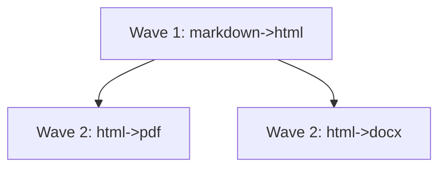

# DAG Execution

`DagExecutor` executes a `MultiTargetDag` in dependency order.

## Wave-based execution

The executor repeatedly partitions edges into:

- a **ready wave** whose source formats already exist,
- remaining edges that must wait.

Each ready wave runs in parallel with Rayon.

## Single vs collection edges

- `InputKind::Single` dispatches to a registered `Transform`
- `InputKind::Collection` dispatches to a registered `AggregationTransform`

## Caching in DAG execution

When configured with `with_cache`, `DagExecutor` loads `.renderflow-dag-cache.json`, hashes each node by `input + from + to`, and skips repeated single-edge work on cache hits.

## Error behavior

DAG execution fails when:

- a required transform was never registered,
- a transform returns an error,
- collection-edge scratch I/O fails.

## Parallelism model

Standard builds parallelize **per output** after the transform phase. Graph builds parallelize **per wave** inside the DAG. Both approaches use Rayon, but at different levels of abstraction.
