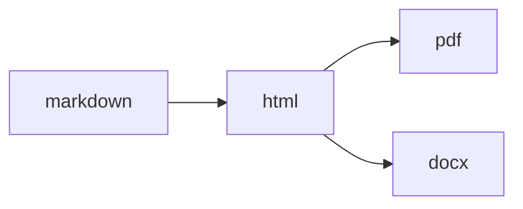

# Graph Engine

The graph engine lives in `src/graph/` and models conversions as a directed graph.

## Core types

| Type | Role |
|---|---|
| `Format` | graph node label |
| `TransformEdge` | weighted edge with `cost`, `quality`, and `input_kind` |
| `TransformGraph` | full conversion graph |
| `TransformPath` | ordered path with total cost/quality |
| `MultiTargetDag` | merged execution DAG for one source and many targets |

## Formats

`Format` includes:

- document formats: `markdown`, `html`, `pdf`, `docx`, `epub`, `rst`, `latex`, `fountain`
- image formats such as `jpeg`, `png`, `tiff`, `cbz`
- many audio formats such as `wav`, `flac`, `mp3`, `ogg`, `opus`, `ac3`, `dts`, `midi`

## Edge metadata

Each edge records:

- source format
- target format
- relative `cost`
- expected `quality`
- `input_kind`: `single` or `collection`

## Graph construction from YAML

`build_graph_and_executor_from_yaml` reads a transform YAML file and:

1. validates every definition,
2. parses `from` / `to` into `Format`,
3. inserts a `TransformEdge` into `TransformGraph`,
4. registers the executable transform in `DagExecutor`.

## Pathfinding

`TransformGraph` provides:

- `find_path` / `find_path_with_mode`
- `find_all_paths`
- `find_pareto_paths`
- `reachable_from`

Path selection uses A* with mode-specific edge weights.

## Multi-target merging

When multiple targets share work, `MultiTargetDag` keeps a single intermediate edge. If two edges connect the same `(from, to)` pair, the cheaper edge is retained.

In that example, `markdown -> html` is executed once and reused.
