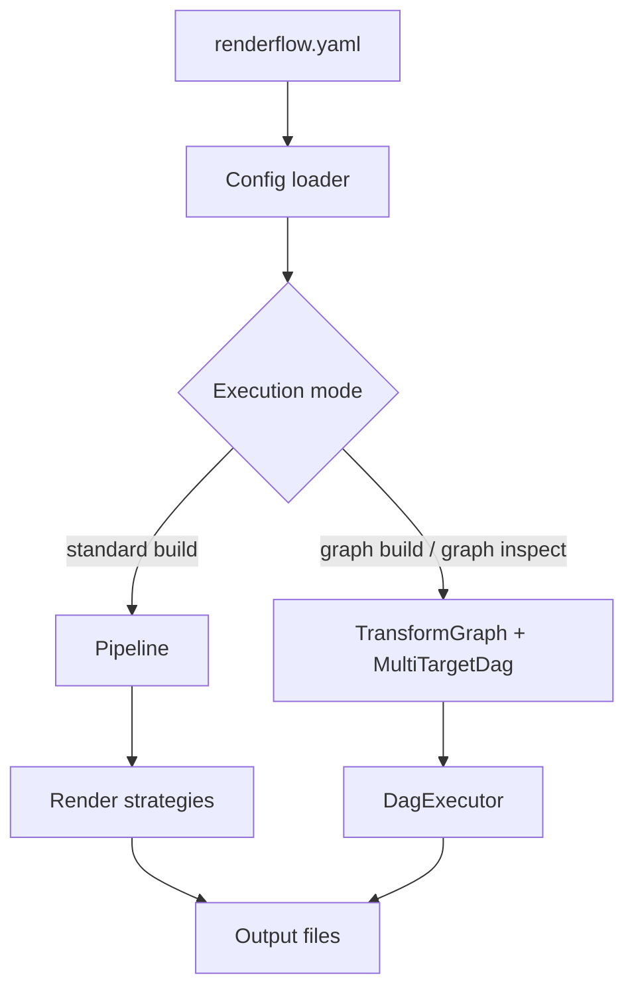

# Architecture Overview

Renderflow now documents architecture in two complementary forms:

1. a **canonical knowledge base** under `docs/architecture/**` that defines the
   project's identity, foundations, domain language, governance, experience
   philosophy, and meta-governance, and
2. a set of **implementation views** that explain how today's graph engine, DAG
   execution, plugin architecture, and execution plans currently work.

The canonical starting point is [`META`](meta/META.md), which explains how the
knowledge base is organized and how each architecture document owns one concern.

## Current structural model

At the highest level, Renderflow still operates through three major runtime
stages:

1. config loading and validation,
2. transformation / planning,
3. execution and caching.



## Standard pipeline

- validates document/audio/image compatibility,
- normalizes asset paths,
- applies transforms,
- renders each output in parallel.

## Graph pipeline

- loads transform definitions from YAML,
- turns formats into graph nodes and transforms into weighted edges,
- selects paths with the active optimization mode,
- groups independent work into waves.

## Knowledge-base reading order

Use the architecture knowledge base in this order:

1. `identity/` for purpose, vision, beliefs, principles, and pillars,
2. `foundation/` for methodology, assumptions, systems, architecture, and roadmap,
3. `domain/` for vocabulary and human assumptions,
4. `governance/` for major accepted decisions,
5. `experience/` for design philosophy and reusable design language,
6. `meta/` for AI governance, epistemology, and architecture-framework guidance.

## Implementation views

| Area | Module |
|---|---|
| CLI | `src/cli.rs`, `src/main.rs` |
| Config | `src/config.rs` |
| Standard pipeline | `src/pipeline/*`, `src/commands/build.rs` |
| Graph engine | `src/graph/*` |
| AI | `src/ai/*`, `src/transforms/ai.rs` |
| Plugins | `src/transforms/plugin.rs`, `src/commands/plugin.rs` |
| Caching | `src/cache.rs`, `src/incremental.rs` |

## Execution sketch

```text
source file
  -> config validation
  -> transform/caching layer
  -> renderer or DAG executor
  -> persisted outputs + cache metadata
```
