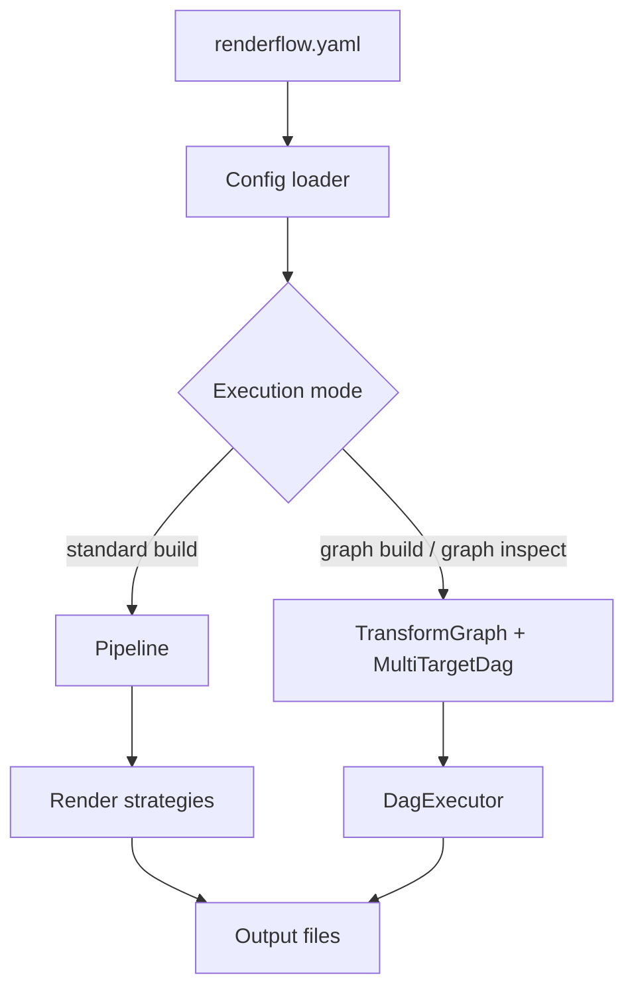

# Architecture Overview

Renderflow has three main layers:

1. config loading and validation,
2. transformation / planning,
3. execution and caching.



## Standard pipeline

- validates document/audio/image compatibility,
- normalizes asset paths,
- applies transforms,
- renders each output in parallel.

## Graph pipeline

- loads transform definitions from YAML,
- turns formats into graph nodes and transforms into weighted edges,
- selects paths with the active optimization mode,
- groups independent work into waves.

## Key crates and modules

| Area | Module |
|---|---|
| CLI | `src/cli.rs`, `src/main.rs` |
| Config | `src/config.rs` |
| Standard pipeline | `src/pipeline/*`, `src/commands/build.rs` |
| Graph engine | `src/graph/*` |
| AI | `src/ai/*`, `src/transforms/ai.rs` |
| Plugins | `src/transforms/plugin.rs`, `src/commands/plugin.rs` |
| Caching | `src/cache.rs`, `src/incremental.rs` |

## Execution sketch

```text
source file
  -> config validation
  -> transform/caching layer
  -> renderer or DAG executor
  -> persisted outputs + cache metadata
```
