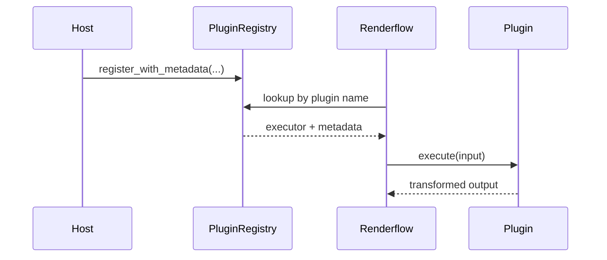

# Plugin Architecture

Plugins are runtime transform executors.

## Main components

| Component | Purpose |
|---|---|
| `PluginExecutor` | trait implemented by the plugin |
| `PluginRegistry` | stores executors and metadata |
| `PluginMetadata` | discovery, validation, and diagnostics |
| `PluginContext` | working directory, temp dir, dry-run flag, namespaced config |
| `PluginTransform` | adapter that lets a plugin participate like a transform |

## Lifecycle

## Capabilities

Plugins can advertise whether they support:

- dry-run behavior
- deterministic caching
- richer diagnostics
- optimization metadata

## Current CLI scope

The core CLI does not auto-discover plugin binaries or dynamic libraries. Plugin registration is a library concern today.
