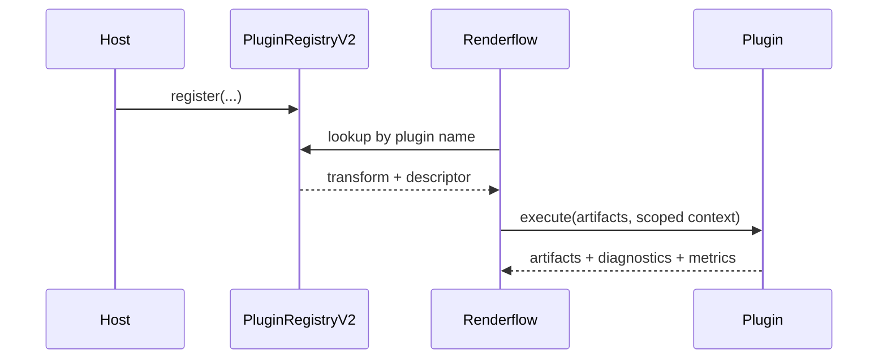

# Plugin Architecture

Plugins are runtime transform executors. New extensions use the versioned,
artifact-native v2 contract; the original text contract is retained as a
compatibility surface.

## Main components

| Component | Purpose |
|---|---|
| `PluginTransformV2` | typed single/collection artifact transform contract |
| `PluginRegistryV2` | explicit duplicate and capability-safe replacement policy |
| `PluginExecutionContext` | scoped store, process, cancellation, progress, and identity services |
| `PluginLifecycleObserver` | immutable lifecycle event observations without mutation authority |
| `PluginExecutor` | trait implemented by the plugin |
| `PluginRegistry` | stores executors and metadata |
| `PluginMetadata` | discovery, validation, and diagnostics |
| `PluginContext` | working directory, temp dir, dry-run flag, namespaced config |
| `PluginTransform` | adapter that lets a plugin participate like a transform |

## Lifecycle

```mermaid
sequenceDiagram
  participant Host
  participant Registry as PluginRegistryV2
  participant RF as Renderflow
  participant Plugin
  Host->>Registry: register(...)
  RF->>Registry: lookup by plugin name
  Registry-->>RF: transform + descriptor
  RF->>Plugin: execute(artifacts, scoped context)
  Plugin-->>RF: artifacts + diagnostics + metrics
```

## Capabilities

V2 plugins declare:

- input cardinality and supported formats
- capability, implementation version, and required providers
- determinism and enforceable cache policy
- loss/fidelity behavior
- typed configuration schema

## Current CLI scope

The core CLI does not auto-discover plugin binaries or dynamic libraries. Plugin registration is a library concern today.
