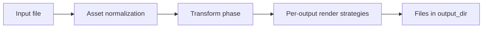
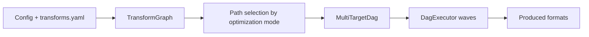

# Pipelines

Renderflow has two related execution models.

## 1. Standard build pipeline

Implemented in `src/commands/build.rs` and `src/pipeline/pipeline.rs`, this is the default path for `renderflow build`.

### Transform phase

The standard registry runs transforms in a fixed order:

1. `EmojiTransform`
2. `VariableSubstitutionTransform`
3. `SyntaxHighlightTransform`
4. optional YAML-defined command/AI transforms

### Render phase

After transforms complete, Renderflow renders each configured output in parallel. The implementation uses Rayon to fan out per-output work once transformed content is ready.

### Why this split matters

- transforms are pure string-to-string operations,
- render steps are output-specific and may call Pandoc, Tectonic, or FFmpeg,
- the split makes caching easier because transform outputs and final outputs can be cached independently.

## 2. Graph execution pipeline

`renderflow build --target ...` and `renderflow build --all` use `src/commands/graph_build.rs`.

Graph mode is best when conversion paths are dynamic or multi-hop, for example `markdown -> html -> pdf`.

!!! note
    Graph execution currently builds its `DagExecutor` from YAML command transforms and AI transforms. The standalone plugin API exists, but graph construction does not currently wire plugin-backed edges in `build_graph_and_executor_from_yaml`.

## Failure behavior

- Standard `build` uses **fail-fast** transform behavior.
- `watch` uses **continue-on-error** transform behavior.
- Render errors are aggregated per output so one failed output does not automatically hide sibling results.
